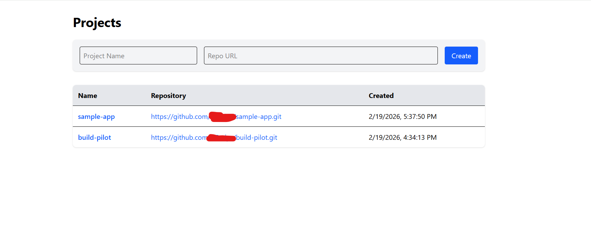
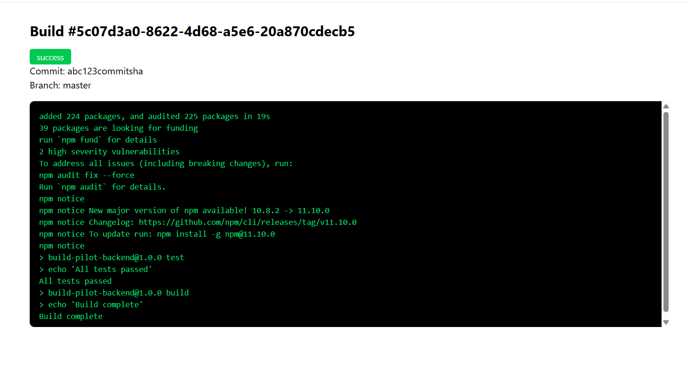

# BuildPilot - Mini CI/CD Platform

A lightweight CI/CD system that automatically builds and deploys applications when code is pushed to a Git repository.

## Architecture

```
┌─────────────┐     ┌──────────────────┐     ┌─────────────┐
│   GitHub     │────▶│  Express Server  │────▶│  Bull Queue  │
│  (Webhook)   │     │  (API + WebSocket)│     │   (Redis)    │
└─────────────┘     └──────────────────┘     └──────┬──────┘
                                                     │
                    ┌──────────────────┐              │
                    │   PostgreSQL     │◀─────────────┤
                    │  (Build History) │              │
                    └──────────────────┘              ▼
                                              ┌─────────────┐
                    ┌──────────────────┐      │ Build Worker │
                    │  React Frontend  │      │  (Dockerode) │
                    │   (Dashboard)    │      └──────┬──────┘
                    └──────────────────┘              │
                                                     ▼
                                              ┌─────────────┐
                                              │   Docker     │
                                              │ (Container)  │
                                              └─────────────┘
```

## Screenshots

### Dashboard - Projects List

Create and manage all your connected repositories from one place.



### Project Detail - Build History & Deployments

View build history with status badges, retry failed builds, and manage deployments with one-click rollback.


### Build Detail - Real-time Logs

Watch your builds execute in real-time with a terminal-style log viewer powered by WebSocket streaming.



### Technical Flow

1. Developer pushes code → GitHub sends webhook to BuildPilot
2. Server verifies webhook signature and creates a build record
3. Build job is enqueued in Bull queue (backed by Redis)
4. Worker picks up the job:
   - Clones the repository
   - Reads `buildpilot.yml` config from repo root
   - Pulls the specified Docker image
   - Copies code into a container
   - Executes build steps sequentially
   - Streams logs in real-time via Redis Pub/Sub → WebSocket
5. On success, deploys to target environment (creates a running container)
6. Stores build logs, config, and deployment metadata in PostgreSQL

## Tech Stack

**Backend:** Node.js, Express.js, PostgreSQL, Redis, Bull, Dockerode, WebSocket
**Frontend:** React (Vite), Tailwind CSS, Axios
**DevOps:** Docker, Docker Compose

## Prerequisites

- [Docker Desktop](https://www.docker.com/products/docker-desktop/) installed and running
- [Git](https://git-scm.com/)
- [ngrok](https://ngrok.com/) (for receiving GitHub webhooks locally)

## Quick Start

### 1. Clone the repository

```bash
git clone https://github.com/DPariya/build-pilot.git
cd build-pilot
```

### 2. Set up environment variables

```bash
cp backend/.env.example backend/.env
```

Edit `backend/.env` and update values as needed.

### 3. Start the platform

```bash
docker compose up -d --build
```

This starts:

- **PostgreSQL** (port 5432) — database
- **Redis** (port 6379) — job queue and pub/sub
- **Backend** (port 3000) — API server
- **Frontend** (port 80) — dashboard

### 4. Run database migrations

```bash
docker exec -it build-pilot-backend-1 node scripts/migrate.js
```

### 5. Open the dashboard

Visit `http://localhost` in your browser.

## Connecting a Repository

### Step 1: Create a project

Open the dashboard and create a new project by entering:

- **Project Name** — any name for your project
- **Repository URL** — the GitHub clone URL (e.g., `https://github.com/DPariya/sample-app.git`)

### Step 2: Set up the webhook on GitHub

1. Go to your GitHub repo → **Settings** → **Webhooks** → **Add webhook**
2. Start ngrok to expose your local server:
   ```bash
   ngrok http 3000
   ```
3. Configure the webhook:
   - **Payload URL:** `https://<your-ngrok-url>/api/webhooks/github`
   - **Content type:** `application/json`
   - **Secret:** Use the value from your `.env` file (`GITHUB_WEBHOOK_SECRET`)
   - **Events:** Just the push event
4. Click **Add webhook**

### Step 3: Add `buildpilot.yml` to your repo

Create a `buildpilot.yml` file in the root of your repository:

```yaml
name: my-app

build:
  image: node:18
  steps:
    - npm install
    - npm test
    - npm run build

deploy:
  target: production
  environment:
    NODE_ENV: production
    PORT: 3000
```

### Step 4: Push code

```bash
git add .
git commit -m "add buildpilot config"
git push
```

The build will trigger automatically. Open the dashboard to see real-time logs.

## Sample App for Testing

A sample application is available for testing: [sample-app](https://github.com/DPariya/sample-app)

Clone it, add the webhook, and push changes to see BuildPilot in action.

## API Endpoints

### Projects

| Method | Endpoint            | Description          |
| ------ | ------------------- | -------------------- |
| POST   | `/api/projects`     | Create a new project |
| GET    | `/api/projects`     | List all projects    |
| GET    | `/api/projects/:id` | Get project details  |
| PUT    | `/api/projects/:id` | Update a project     |
| DELETE | `/api/projects/:id` | Delete a project     |

### Builds

| Method | Endpoint                   | Description                 |
| ------ | -------------------------- | --------------------------- |
| GET    | `/api/projects/:id/builds` | List builds for a project   |
| GET    | `/api/builds/:id`          | Get build details with logs |
| POST   | `/api/builds/:id/retry`    | Retry a failed build        |

### Deployments

| Method | Endpoint                                  | Description           |
| ------ | ----------------------------------------- | --------------------- |
| GET    | `/api/deployments/:projectId/deployments` | List deployments      |
| POST   | `/api/deployments/:id/rollback`           | Rollback a deployment |

### Webhooks

| Method | Endpoint               | Description             |
| ------ | ---------------------- | ----------------------- |
| POST   | `/api/webhooks/github` | GitHub webhook receiver |

### Health

| Method | Endpoint  | Description  |
| ------ | --------- | ------------ |
| GET    | `/health` | Health check |

### WebSocket

Connect to `ws://localhost:3000` and send:

```json
{ "buildId": "<build-uuid>" }
```

To receive real-time build logs.

## Config File Reference (buildpilot.yml)

```yaml
name: my-app # Project name

build:
  image: node:18 # Docker image for build environment
  steps: # Commands to execute sequentially
    - npm install
    - npm test
    - npm run build

deploy:
  target: production # Target environment
  environment: # Environment variables for deployment
    NODE_ENV: production
    PORT: 3000
```

## Project Structure

```
build-pilot/
├── backend/
│   ├── src/
│   │   ├── config/          # Database and queue configuration
│   │   ├── controllers/     # Route handlers
│   │   ├── middlewares/      # Webhook signature verification
│   │   ├── models/          # Database queries
│   │   ├── routes/          # Express routes
│   │   ├── services/        # Docker, deploy, rollback logic
│   │   ├── utils/           # Logger, YAML parser
│   │   ├── websocket/       # WebSocket server
│   │   ├── workers/         # Bull queue workers
│   │   └── app.js           # Express app setup
│   ├── migrations/          # SQL migration files
│   ├── scripts/             # Migration runner
│   ├── Dockerfile
│   └── server.js
├── frontend/
│   ├── src/
│   │   ├── components/      # React components
│   │   ├── services/        # API client
│   │   └── App.jsx
│   ├── Dockerfile
│   └── nginx.conf
├── docker-compose.yml
└── README.md
```

## Future Improvements

- **Auto-register webhooks** — Use GitHub API to automatically create webhooks when a project is added, eliminating manual setup
- **Multi-stage builds** — Support test → build → deploy pipeline stages with individual status tracking
- **Email notifications** — Send build/deployment status notifications via email
- **Build caching** — Cache `node_modules` and Docker layers between builds for faster execution
- **Manual approval gates** — Require manual approval before deploying to production
- **Environment-specific deployments** — Support staging/production with different configs
- **Build artifacts** — Store and download build outputs
